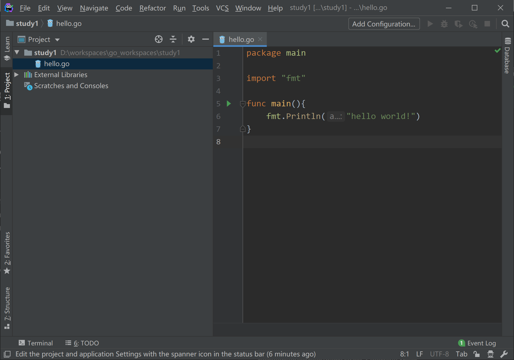
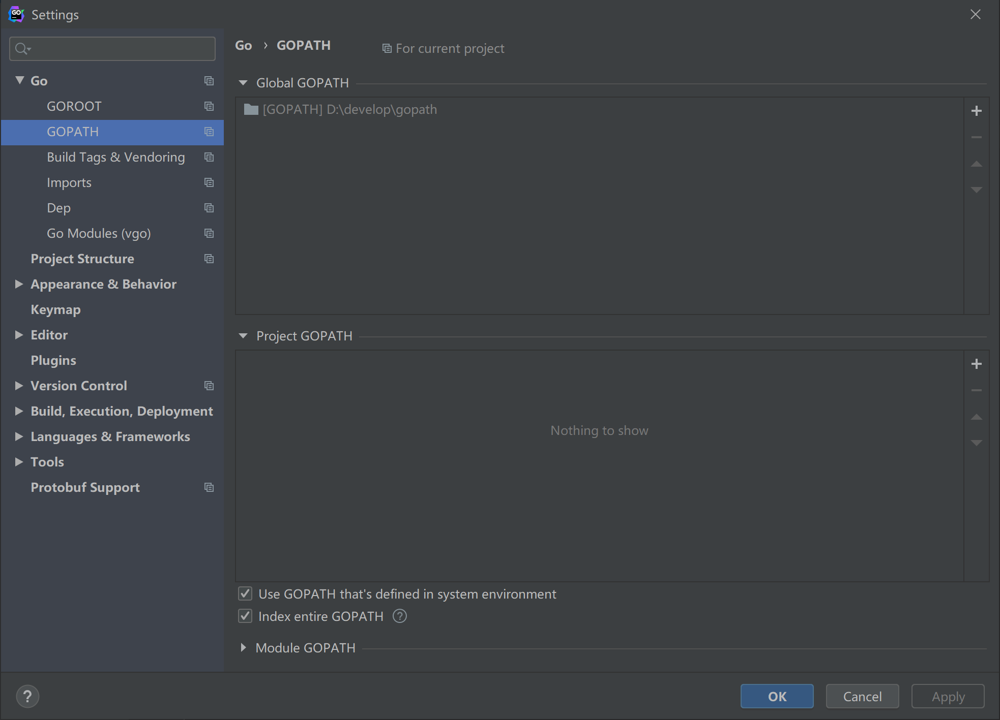
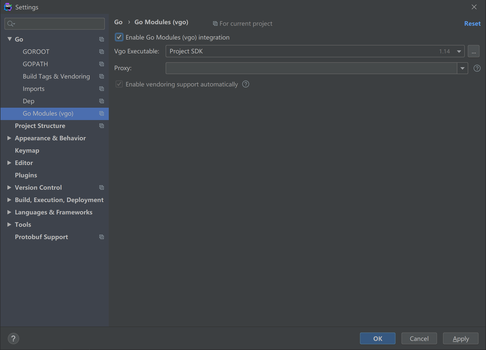
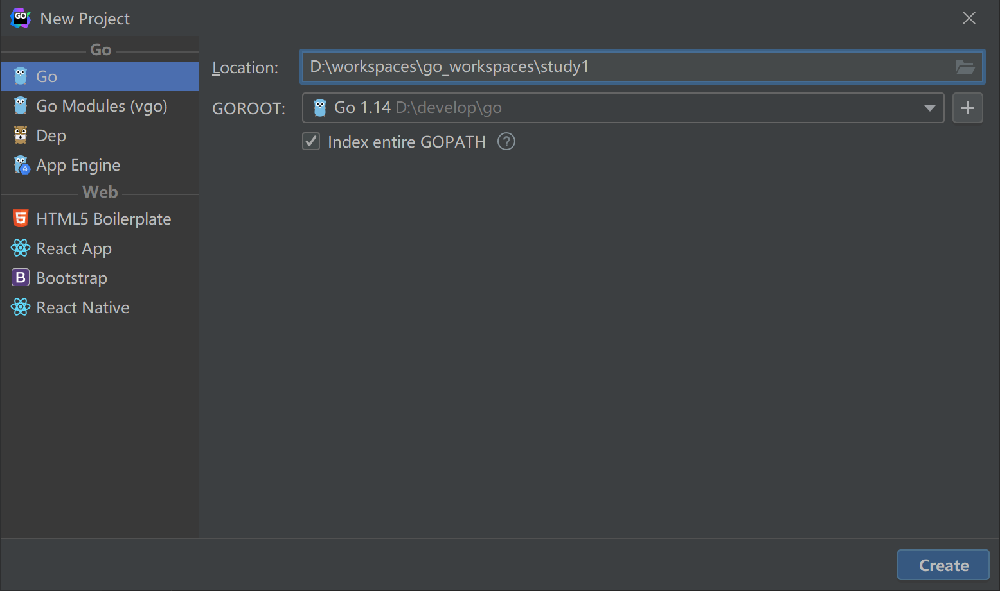
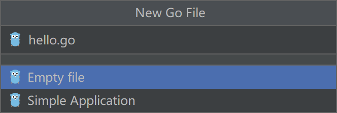
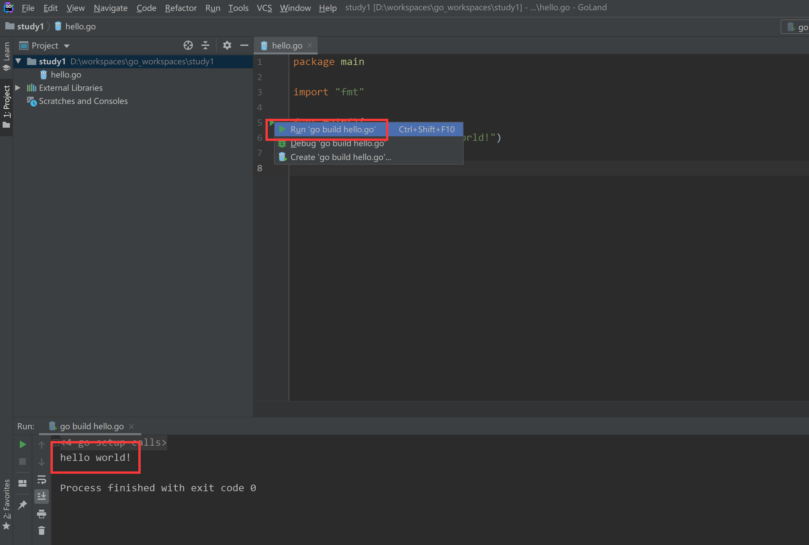
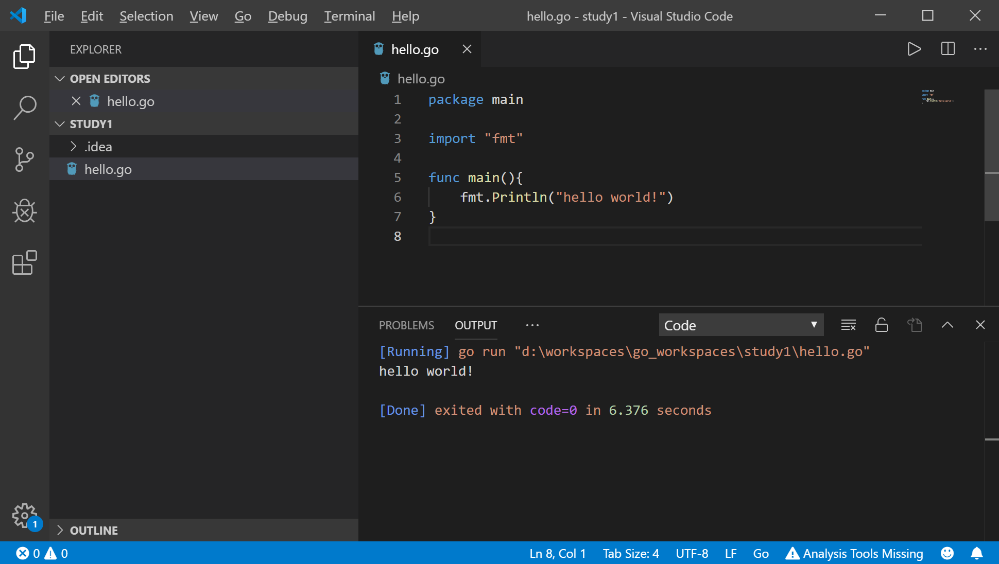

# 一、开发环境IDE安装

**工欲善其事，必先利其器**

这里推荐两款golang开发工具，一个是`goland`，一个是`VSCode`；goland是收费的，专门用于golang开发的IDE，功能强大，支持go modules；VSCode需要安装插件，免费，功能也很强大但是配置略繁琐；

PS：Golang可以通过申请JetBrains全家桶的学生认证license来免费使用，具体请自行搜索，目前已经不需要等待审核，随申随用。

## 1. Goland

`JetBrains`旗下的产品众多，最出名的就是IDEA，java开发工具；当然PHP，Python，Scala等开发语言，数据库版本都是有的；

`JetBrains`的官方网站为：https://www.jetbrains.com/go/



1. 首先打开File->Setting或者Ctrl+Alt+S,设置goroot和gopath，默认会获取环境变量配置




2. 如果我们需要使用go modules功能，需要进行开启设置；



3. 最好我们编写helloworld运行

新建项目study1，选择目录



新建go文件



编写hello world

```go
package main

import "fmt"

func main(){
	fmt.Println("hello world!")
}
```


最后点击左侧启动运行，或者按Ctrl+Shift+F10运行程序



最终我们看到hello world运行成功！

## 2. Goland 常用快捷键

下面列举了一些 Goland 中经常使用到的快捷键。

### 文件操作

| 快捷键           | 作用                                 |
| ---------------- | ------------------------------------ |
| Ctrl + E         | 打开最近浏览过的文件                 |
| Ctrl + N         | 快速打开某个 struct 结构体所在的文件 |
| Ctrl + Shift + N | 快速打开文件                         |
| Shift + F6       | 重命名文件夹、文件、方法、变量名等   |

### 代码格式化

| 快捷键           | 作用                                                         |
| ---------------- | ------------------------------------------------------------ |
| Ctrl + Alt + L   | 格式化代码                                                   |
| Ctrl + 空格      | 代码提示                                                     |
| Ctrl + /         | 单行注释                                                     |
| Ctrl + Shift + / | 多行注释                                                     |
| Ctrl + B 或 F4   | 快速跳转到结构体或方法的定义位置（需将光标移动到结构体或方法的名称上） |
| Ctrl +“+ 或 -”   | 可以将当前（光标所在位置）的方法进行展开或折叠               |

### 查找和定位

| 快捷键                 | 作用                     |
| ---------------------- | ------------------------ |
| Ctrl + R               | 替换文本                 |
| Ctrl + F               | 查找文本                 |
| Ctrl + Shift + F       | 全局查找                 |
| Ctrl + G               | 显示当前光标所在行的行号 |
| Ctrl + Shift + Alt + N | 查找类中的方法或变量     |

### 编辑代码

| 快捷键                      | 作用                                                         |
| --------------------------- | ------------------------------------------------------------ |
| Ctrl + J                    | 快速生成一个代码片段                                         |
| Shift+Enter                 | 向光标的下方插入一行，并将光标移动到该行的开始位置           |
| Ctrl + X                    | 删除当前光标所在行                                           |
| Ctrl + D                    | 复制当前光标所在行                                           |
| Ctrl + Shift + 方向键上或下 | 将光标所在的行进行上下移动（也可以使用 Alt+Shift+方向键上或下） |
| Alt + 回车                  | 自动导入需要导入的包                                         |
| Ctrl + Shift + U            | 将选中的内容进行大小写转化                                   |
| Alt + Insert                | 生成测试代码                                                 |
| Alt + Up/Down               | 快速移动到上一个或下一个方法                                 |
| Ctrl + Alt + Space          | 类名或接口名提示（代码提示）                                 |
| Ctrl + P                    | 提示方法的参数类型（需在方法调用的位置使用，并将光标移动至`( )`的内部或两侧） |

5) 编辑器相关的快捷键

| 快捷键                  | 作用                                 |
| ----------------------- | ------------------------------------ |
| Ctrl + Alt + left/right | 返回至上次浏览的位置                 |
| Alt + left/right        | 切换代码视图                         |
| Ctrl + W                | 快速选中代码                         |
| Alt + F3                | 逐个向下查找选中的代码，并高亮显示   |
| Tab                     | 代码标签输入完成后，按 Tab，生成代码 |
| F2 或 Shift + F2        | 快速定位错误或警告                   |
| Alt + Shift + C         | 查看最近的操作                       |
| Alt + 1                 | 快速打开或隐藏工程面板               |

## 3. VSCode

VSCode 全称 Visual Studio Code，是微软出的一款轻量级代码编辑器，免费、开源而且功能强大。它支持几乎所有主流的程序语言的语法高亮、智能代码补全、自定义热键、括号匹配、代码片段、代码对比 Diff、GIT 等特性，支持插件扩展，并针对网页开发和云端应用开发做了优化。

VSCode的官网：https://code.visualstudio.com/



在VSCode中安装Go插件

进入Extensions后直接搜索go，即可安装


在编辑代码时会提示安装一些插件，选择安装即可；

如果没有提示也可以自行安装，大致如下

```bash
go get -u -v github.com/bytbox/golint
go get -u -v github.com/golang/tools
go get -u -v github.com/lukehoban/go-outline
go get -u -v github.com/newhook/go-symbols
go get -u -v github.com/josharian/impl
go get -u -v github.com/sqs/goreturns
go get -u -v github.com/cweill/gotests
```


## 4. VSCode 常用快捷键

| 快捷键               | 功能                |
| -------------------- | ------------------- |
| F2                   | 重命名符号          |
| Ctrl + L             | 选中当前行          |
| Ctrl + /             | 添加/关闭行注释     |
| Ctrl + ←/→           | 按单词移动光标      |
| Ctrl + Shift + ←/→   | 按单词进行选中      |
| Shift + Alt +A       | 添加/关闭块区域注释 |
| Ctrl + Space         | 输入建议            |
| Ctrl + Shift + Space | 参数提示            |
| F12                  | 跳转到定义处        |
| Alt + F12            | 代码片段显示定义    |
| Shift + F12          | 显示所有引用        |
| Shift + Alt + F      | 格式化代码          |

------

### 通用快捷键

| 快捷键          | 作用                   |
| :-------------- | :--------------------- |
| Ctrl+Shift+P,F1 | 展示全局命令面板       |
| Ctrl+P          | 快速打开最近打开的文件 |
| Ctrl+Shift+N    | 打开新的编辑器窗口     |
| Ctrl+Shift+W    | 关闭编辑器             |
| Ctrl+,          | 首选项                 |
| Ctrl+K Ctrl+S   | 快捷键设置             |

------

### 基础编辑

| 快捷键               | 作用                     |
| :------------------- | :----------------------- |
| Ctrl + X             | 剪切                     |
| Ctrl + C             | 复制                     |
| Alt + ↑/↓            | 移动行上下               |
| Shift + Alt + ↑/↓    | 在当前行上下复制当前行   |
| Ctrl + Shift + K     | 删除行                   |
| Ctrl + Enter         | 在当前行下插入新的一行   |
| Ctrl + Shift + Enter | 在当前行上插入新的一行   |
| Ctrl + Shift + \     | 匹配花括号的闭合处，跳转 |
| Ctrl + ] / [         | 行缩进                   |
| Home / End           | 光标跳转到行头/行尾      |
| Ctrl + Home          | 跳转到页头               |
| Ctrl + End           | 跳转到页尾               |
| Ctrl + ↑/↓           | 行视图上下偏移           |
| Alt + PgUp/PgDown    | 屏视图上下偏移           |
| Ctrl + Shift + [     | 折叠区域代码             |
| Ctrl + Shift + ]     | 展开区域代码             |
| Ctrl + K Ctrl + [    | 折叠所有子区域代码       |
| Ctrl + k Ctrl + ]    | 展开所有折叠的子区域代码 |
| Ctrl + K Ctrl + 0    | 折叠所有区域代码         |
| Ctrl + K Ctrl + J    | 展开所有折叠区域代码     |
| Ctrl + K Ctrl + C    | 添加行注释               |
| Ctrl + K Ctrl + U    | 删除行注释               |
| Ctrl + /             | 添加/关闭行注释          |
| Shift + Alt +A       | 添加/关闭块区域注释      |
| Alt + Z              | 添加/关闭词汇包含        |

------

### 导航

| 快捷键             | 作用                     |
| :----------------- | :----------------------- |
| Ctrl + T           | 列出所有符号             |
| Ctrl + G           | 跳转行                   |
| Ctrl + P           | 跳转文件                 |
| Ctrl + Shift + O   | 跳转到符号处             |
| Ctrl + Shift + M   | 打开问题展示面板         |
| F8                 | 跳转到下一个错误或者警告 |
| Shift + F8         | 跳转到上一个错误或者警告 |
| Ctrl + Shift + Tab | 切换到最近打开的文件     |
| Alt + ←/→          | 向后、向前               |
| Ctrl + M           | 进入用Tab来移动焦点      |

------

### 查询与替换

| 快捷键             | 作用                             |
| :----------------- | :------------------------------- |
| Ctrl + F           | 查询                             |
| Ctrl + H           | 替换                             |
| F3 / Shift + F3    | 查询下一个/上一个                |
| Alt + Enter        | 选中所有出现在查询中的           |
| Ctrl + D           | 匹配当前选中的词汇或者行         |
| Ctrl + K  Ctrl + D | 移动当前选择到下个匹配选择的位置 |
| Alt + C / R / W    | 不分大小写/使用正则/全字匹配     |

------

### 多行光标操作与选择

| 快捷键                           | 作用                                     |
| :------------------------------- | :--------------------------------------- |
| Alt + Click                      | 插入光标-支持多个                        |
| Ctrl + Alt + ↑/↓                 | 上下插入光标-支持多个                    |
| Ctrl + U                         | 撤销最后一次光标操作                     |
| Shift + Alt + I                  | 插入光标到选中范围内所有行结束符         |
| Ctrl + L                         | 选中当前行                               |
| Ctrl + Shift + L                 | 选择所有出现在当前选中的行-操作          |
| Ctrl + F2                        | 选择所有出现在当前选中的词汇-操作        |
| Shift + Alt + →                  | 从光标处扩展选中全行                     |
| Shift + Alt + ←                  | 收缩选择区域                             |
| Shift + Alt + (drag mouse)       | 鼠标拖动区域，同时在多个行结束符插入光标 |
| Ctrl + Shift + Alt + (Arrow Key) | 也是插入多行光标的[方向键控制]           |
| Ctrl + Shift + Alt + PgUp/PgDown | 也是插入多行光标的[整屏生效]             |

------

### 丰富的语言操作

| 快捷键               | 作用                           |
| :------------------- | :----------------------------- |
| Ctrl + Space         | 输入建议[智能提示]             |
| Ctrl + Shift + Space | 参数提示                       |
| Tab                  | Emmet指令触发/缩进             |
| Shift + Alt + F      | 格式化代码                     |
| Ctrl + K Ctrl + F    | 格式化选中部分的代码           |
| F12                  | 跳转到定义处                   |
| Alt + F12            | 代码片段显示定义               |
| Ctrl + K F12         | 在其他窗口打开定义处           |
| Ctrl + .             | 快速修复部分可以修复的语法错误 |
| Shift + F12          | 显示所有引用                   |
| F2                   | 重命名符号                     |
| Ctrl + Shift + . / , | 替换下个值                     |
| Ctrl + K Ctrl + X    | 移除空白字符                   |
| Ctrl + K M           | 更改页面文档格式               |

------

### 编辑器管理

| 快捷键                     | 作用                     |
| :------------------------- | :----------------------- |
| Ctrl + F4, Ctrl + W        | 关闭编辑器               |
| Ctrl + k F                 | 关闭当前打开的文件夹     |
| Ctrl + \                   | 切割编辑窗口             |
| Ctrl + 1/2/3               | 切换焦点在不同的切割窗口 |
| Ctrl + K Ctrl ←/→          | 切换焦点在不同的切割窗口 |
| Ctrl + Shift + PgUp/PgDown | 切换标签页的位置         |
| Ctrl + K ←/→               | 切割窗口位置调换         |

------

### 文件管理

| 快捷键             | 作用                                   |
| :----------------- | :------------------------------------- |
| Ctrl + N           | 新建文件                               |
| Ctrl + O           | 打开文件                               |
| Ctrl + S           | 保存文件                               |
| Ctrl + Shift + S   | 另存为                                 |
| Ctrl + K S         | 保存所有当前已经打开的文件             |
| Ctrl + F4          | 关闭当前编辑窗口                       |
| Ctrl + K Ctrl + W  | 关闭所有编辑窗口                       |
| Ctrl + Shift + T   | 撤销最近关闭的一个文件编辑窗口         |
| Ctrl + K Enter     | 保持开启                               |
| Ctrl + Shift + Tab | 调出最近打开的文件列表，重复按会切换   |
| Ctrl + Tab         | 与上面一致，顺序不一致                 |
| Ctrl + K P         | 复制当前打开文件的存放路径             |
| Ctrl + K R         | 打开当前编辑文件存放位置【文件管理器】 |
| Ctrl + K O         | 在新的编辑器中打开当前编辑的文件       |

------

### 显示

| 快捷键           | 作用                         |
| :--------------- | :--------------------------- |
| F11              | 切换全屏模式                 |
| Shift + Alt + 1  | 切换编辑布局【目前无效】     |
| Ctrl + =/-       | 放大 / 缩小                  |
| Ctrl + B         | 侧边栏显示隐藏               |
| Ctrl + Shift + E | 资源视图和编辑视图的焦点切换 |
| Ctrl + Shift + F | 打开全局搜索                 |
| Ctrl + Shift + G | 打开Git可视管理              |
| Ctrl + Shift + D | 打开DeBug面板                |
| Ctrl + Shift + X | 打开插件市场面板             |
| Ctrl + Shift + H | 在当前文件替换查询替换       |
| Ctrl + Shift + J | 开启详细查询                 |
| Ctrl + Shift + U | 打开输出窗口                 |
| Ctrl + Shift + V | 预览Markdown文件             |
| Ctrl + K V       | 在边栏打开Markdown预览       |
| Ctrl + K Z       | Zen模式                      |

------

### 调试

| 快捷键            | 作用                |
| :---------------- | :------------------ |
| F9                | 添加/解除断点       |
| F5                | 启动调试 / 继续     |
| F11 / Shift + F11 | 单步进入 / 单步跳出 |
| F10               | 单步跳过            |
| Ctrl + K Ctrl + I | 显示悬浮            |

------

### 集成终端

| 快捷键                | 作用                 |
| :-------------------- | :------------------- |
| Ctrl + `              | 打开集成终端         |
| Ctrl + Shift + `      | 创建一个新的终端     |
| Ctrl + C              | 复制所选             |
| Ctrl + V              | 复制到当前激活的终端 |
| Shift + PgUp / PgDown | 页面上下翻屏         |
| Ctrl + Home / End     | 滚动到页面头部或尾部 |